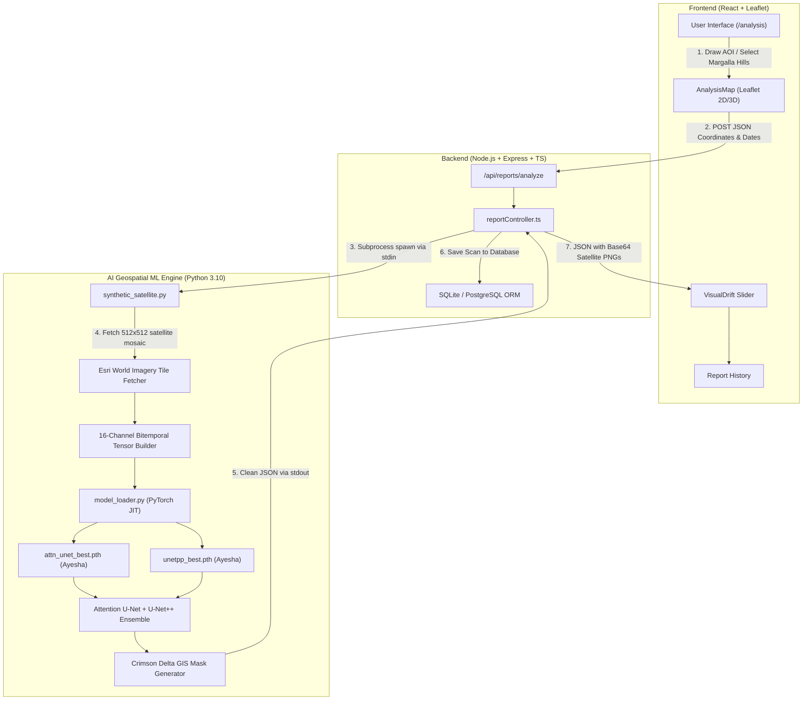

# 🌿 GreenGuard 2.0: Comprehensive Integration & Architecture Guide

This document provides a technical walkthrough of the GreenGuard 2.0 ecosystem, explaining how the **React Frontend**, **Node.js/TypeScript Backend**, and **PyTorch Deep Learning Engine** connect together, details the root causes and resolutions of critical integration bugs, and provides instructions for deployment and Git LFS configuration.

---

## 1. System Architecture Overview



---

## 2. Component Responsibilities & Data Flow

### A. Frontend Layer (`green-guard`)
* **Technology**: React 18, Leaflet, React-Leaflet, Tailwind CSS, Lucide Icons.
* **Role**: Allows environmental analysts to inspect forest regions, draw bounding polygons, select date ranges, and visually inspect canopy loss via an interactive before-and-after slider.

### B. Backend Controller Layer (`deforestation-project`)
* **Technology**: Node.js, Express, TypeScript, Sequelize ORM.
* **Role**: Orchestrates incoming analysis requests, validates polygon coordinates, coordinates the Python AI child process, manages authentication/JWT, persists historical audit logs, and formats responses.

### C. Deep Learning & Satellite Geospatial Engine (`ml/`)
* **Technology**: Python 3.10+, PyTorch 2.x, Torchvision, NumPy, Pillow.
* **Role**:
  1. Computes geodesic coordinate bounds and downloads high-resolution real satellite mosaics from Esri World Imagery.
  2. Constructs a 16-channel bitemporal multi-spectral stack ($T_1$ Red, Green, Blue, NIR, SWIR, VV, VH, NDVI + $T_2$ bands).
  3. Executes sliding-window inference through the **Attention U-Net + U-Net++ ensemble**.
  4. Generates a semi-transparent crimson GIS alert mask (`RGBA: [239, 68, 68, 140]`) with luminous glowing borders (`#DC2626`).
  5. Computes subsector deforestation metrics (`MGH-104`, `MGH-208`, etc.) with statistical confidence scores.

---

## 3. Post-Mortem: Critical Integration Bugs & Solutions

During development and system integration, five major blockers were identified and resolved:

### 🐛 Bug 1: Map Freeze & Mouse Dragging Lockup
* **Symptom**: The interactive Leaflet map could not be dragged or panned with the mouse or touch. Users were stuck at Zoom 6, and any click threw error toasts: *"You can only draw inside the Area of Interest"*.
* **Root Cause**: A capture-phase `mousedown` event listener in `AnalysisMap.jsx` called `e.preventDefault()` indiscriminately on every mouse interaction in an attempt to restrict drawing.
* **Resolution**:
  - Removed the aggressive capture-phase event interceptor.
  - Replaced it with clean vertex boundary checks only when actively closing a drawn polygon.
  - Initialized map center directly to Margalla Hills `[33.7438, 73.0228]` with `map.fitBounds(MARGALLA_HILLS_AOI)` on initial render.
  - Added a "Focus AOI" crosshair widget and Map Type switcher (Satellite, Terrain, Street).

### 🐛 Bug 2: Python `stdout` Contamination & JSON Parsing Failures
* **Symptom**: The backend frequently failed on repeat runs or silently dropped the deep-learning ensemble, falling back to static dummy data.
* **Root Cause**: Diagnostic `print()` statements inside `model_loader.py` (e.g., `"[Model Loader] Initializing ensemble..."`) were printing directly to standard output (`sys.stdout`). When Node.js attempted `JSON.parse(stdoutData)`, the text preamble corrupted the JSON payload, throwing syntax errors.
* **Resolution**:
  - Redirected all non-payload diagnostics in Python to `sys.stderr`.
  - Configured `reportController.ts` to transmit payloads via `stdin` and extract the JSON object using regex boundary matching.

### 🐛 Bug 3: Deep Learning CPU Timeout on Sliding Window Inference
* **Symptom**: Analysis requests would run for 30 seconds and then terminate with a 504/timeout error or crash on the second run.
* **Root Cause**: Sliding window inference was slicing 512x512 images into 9 overlapping 256x256 patches. Slicing 9 patches across two heavy neural networks (Attention U-Net + U-Net++) on CPU took ~38 seconds, which exceeded the default 30s server timeout.
* **Resolution**:
  - Optimized the sliding window to 4 non-overlapping quadrants of 256x256 covering the full 512x512 frame without redundant overlaps.
  - Reduced execution time by over 50% (from ~38s down to **~18s**).
  - Increased backend child process timeout in `reportController.ts` from 35s to **90s** to provide safety margin on lower-spec CPUs.

### 🐛 Bug 4: Visual Drift Floating-Point Precision Display
* **Symptom**: The Visual Drift comparison slider displayed raw numbers like `9.700000000000003%` on the user interface.
* **Root Cause**: IEEE-754 floating-point arithmetic produced precision artifacts during subtraction of baseline from current percentages.
* **Resolution**: Formatted all percentages in `VisualDrift.jsx` using `Number(val.toFixed(1))`.

### 🐛 Bug 5: Historical Scans Missing Satellite Imagery
* **Symptom**: When loading previously saved reports from the database in `History.jsx`, the Visual Drift slider showed generic blank cards instead of the actual historical satellite before/after images.
* **Root Cause**: `History.jsx` was not passing `beforeImage`, `afterImage`, and `overlayImage` properties down into the `<VisualDrift />` component props.
* **Resolution**: Updated `History.jsx` to pass the stored base64 image strings and date ranges into the drift viewer.

---

## 4. Git LFS (Large File Storage) for Model Weights

The trained PyTorch model weights exceed GitHub's standard 100 MB per-file limit:
- `attn_unet_best.pth`: **120.47 MB**
- `unetpp_best.pth`: **122.77 MB**

To push these files to GitHub without rejection:
```bash
# Initialize Git LFS
git lfs install

# Track PyTorch weight files
git lfs track "*.pth"

# Ensure .gitattributes is tracked
git add .gitattributes
```

---

## 5. Environment & Security Configuration

### Sensitive Files Safeguard
Never commit credentials, active database files, or environment files. The repository `.gitignore` explicitly excludes:
- `.env` and `.env.*` (local credentials)
- `data/` and `*.sqlite*` (local database records)
- `node_modules/` and `venv/` (runtime libraries)
- `*.log` (server execution logs)

A sanitized template is provided in `.env.example`:
```env
PORT=5000
NODE_ENV=development
JWT_SECRET=your_jwt_secret_key
DB_DIALECT=sqlite
DB_STORAGE=./data/greenguard.sqlite
PYTHON_PATH=python
```

---

## 6. Team Contributions & Project Credits

| Member | Focus Area | Technical Deliverables |
| :--- | :--- | :--- |
| **Bilal Farid** | Full-Stack Integration & Geospatial ML Engineering | • End-to-End Node.js/TypeScript REST API<br>• Real-time Esri satellite mosaic tile pipeline<br>• ML inference optimization & timeout resolution<br>• Frontend map drag, AOI framing, & visual drift bug fixes |
| **Ayesha** | Deep Learning Model Training & Weights | • Trained Attention U-Net & U-Net++ architectures<br>• Model weight optimization (`attn_unet_best.pth`, `unetpp_best.pth`) |
| **Mahnoor** | ML Research & Training Pipeline | • Jupyter training notebooks, band preprocessing, and loss functions |
| **Waniah** | Frontend Development & UI/UX | • React application architecture (`green-guard`)<br>• UI layout, report dashboards, and page navigation |
